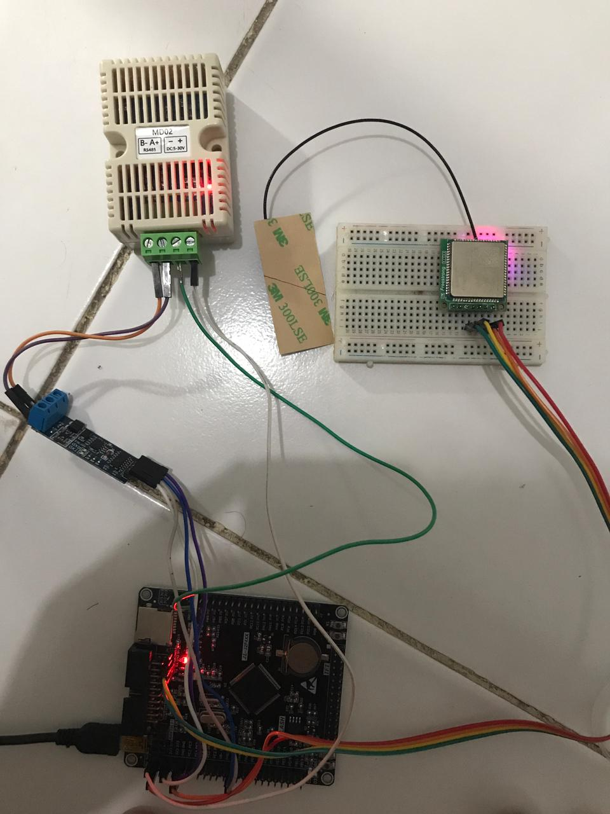
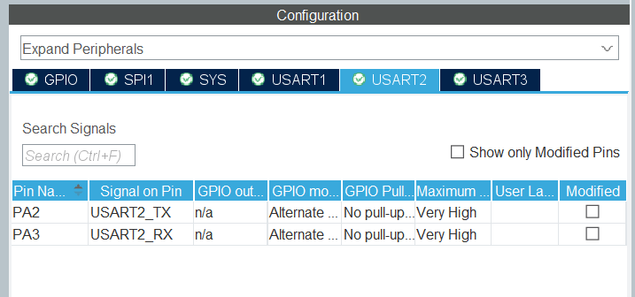
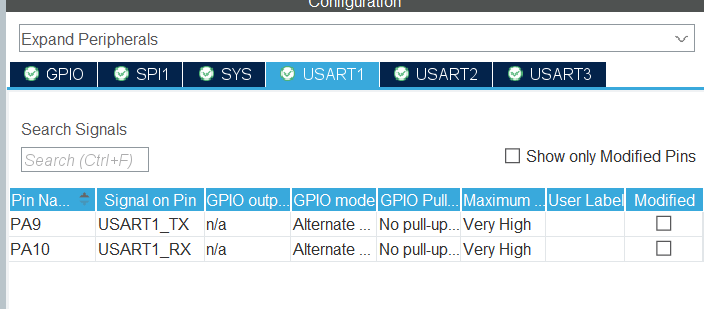
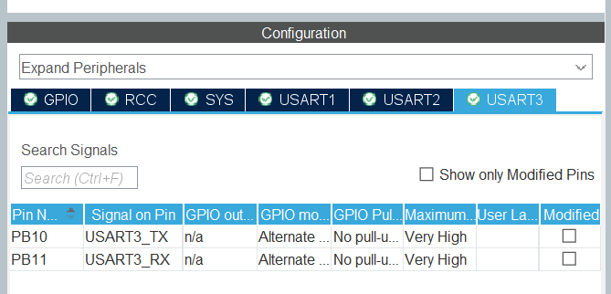
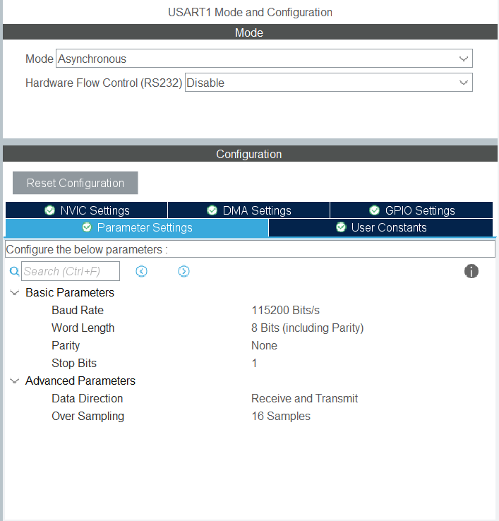
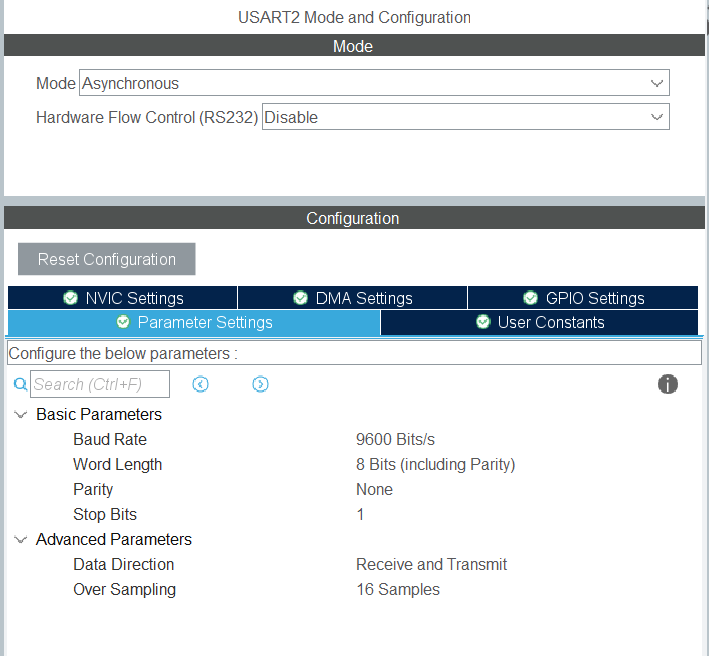
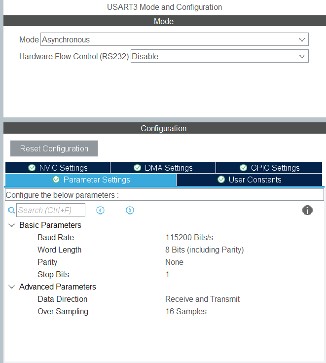
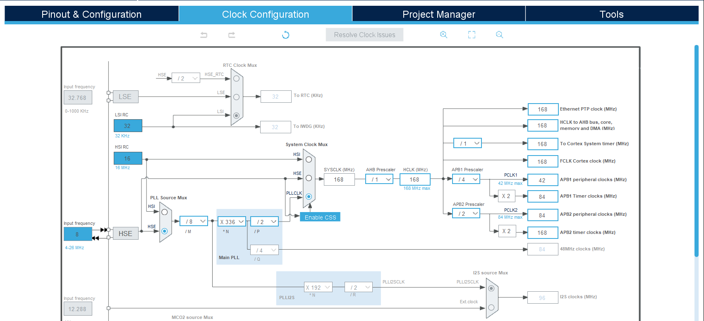
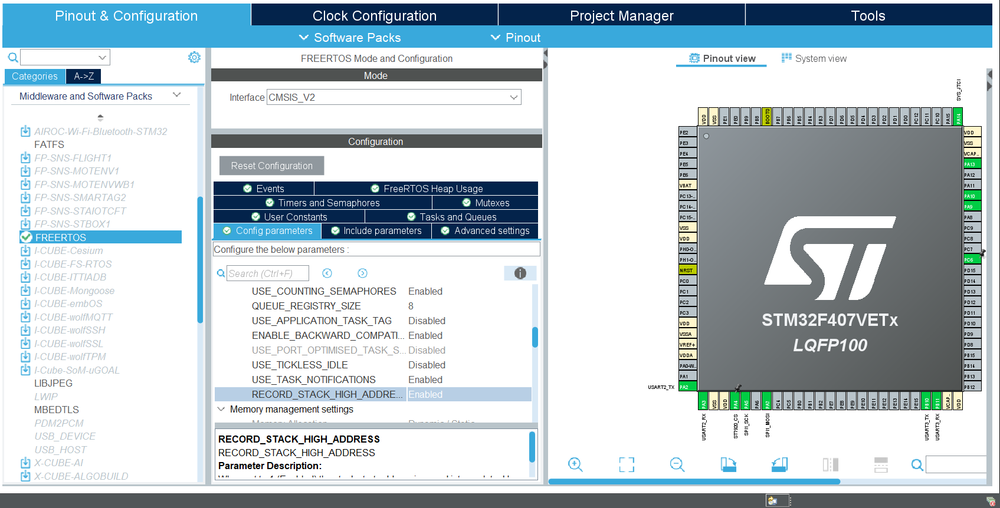
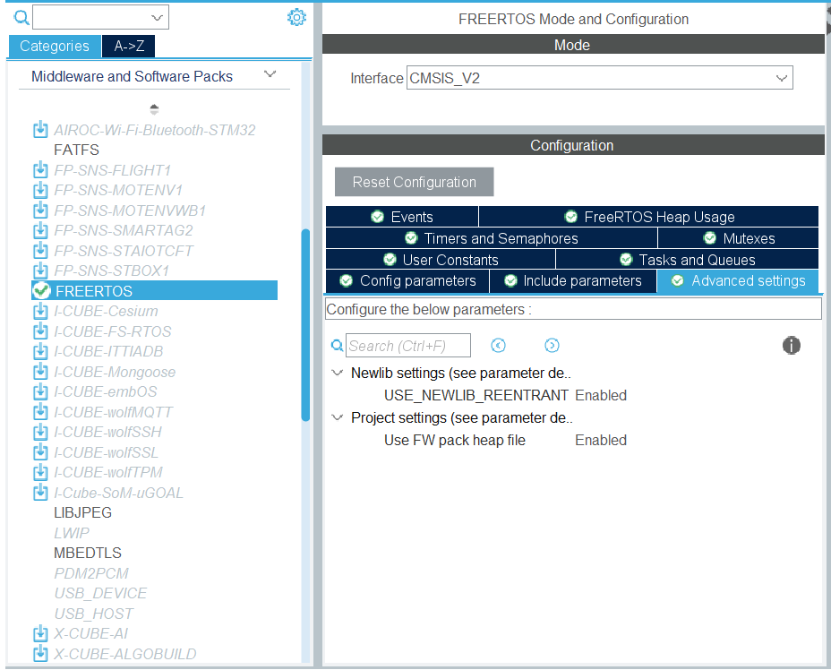

# STM32F407VETx-IoT-Monitor

STM32F407VET6 IoT environment monitor — XY-MD02 temperature & humidity sensor via RS485 Modbus RTU + Quectel EC600K 4G LTE MQTT publish, diadaptasi dari ESP32 Arduino (sparkworks.id) ke STM32 HAL FreeRTOS.

---

## Hardware

| Component | Description |
|-----------|-------------|
| MCU | STM32F407VET6 (LQFP100) |
| 4G LTE | Quectel EC600K-CN module |
| Sensor | XY-MD02 Temperature & Humidity (RS485 Modbus RTU) |
| RS485 | RS485-to-TTL converter module (auto direction) |



---

## Pinout

### XY-MD02 Sensor — USART2 via RS485-TTL

| Signal | STM32 Pin | Mode |
|--------|-----------|------|
| TX | PA2 | USART2_TX |
| RX | PA3 | USART2_RX |

RS485 converter wiring:
```
STM32 PA2 (TX) → RS485 module DI/TX
STM32 PA3 (RX) → RS485 module RO/RX
RS485 module A → XY-MD02 A+
RS485 module B → XY-MD02 B-
XY-MD02 Power  → 7-30V (external supply)
GND STM32      → GND power supply (common ground wajib)
```



### EC600K 4G LTE — USART1

| EC600K Pin | STM32 Pin | Note |
|-----------|-----------|------|
| VIN | 5V | Power |
| GND | GND | Common ground wajib |
| TX | PA10 (USART1_RX) | EC600K TX → STM32 RX |
| RX | PA9 (USART1_TX) | EC600K RX → STM32 TX |



### USART3 — Debug

| Signal | STM32 Pin |
|--------|-----------|
| TX | PB10 |
| RX | PB11 |


---

## UART Mapping

| Peripheral | Bus | Clock | Fungsi | Pin | Baud |
|-----------|-----|-------|--------|-----|------|
| USART1 | APB2 | 84 MHz | EC600K 4G LTE | PA9=TX, PA10=RX | 115200 |
| USART2 | APB1 | 42 MHz | XY-MD02 Sensor | PA2=TX, PA3=RX | 9600 |
| USART3 | APB1 | 42 MHz | Debug print | PB10=TX, PB11=RX | 115200 |





---

## Clock Configuration

HSE 8MHz → PLL → 168MHz

| Parameter | Value |
|-----------|-------|
| Clock source | HSE 8MHz |
| PLLM | 8 |
| PLLN | 336 |
| PLLP | /2 |
| SYSCLK | 168 MHz |
| HCLK | 168 MHz |
| APB1 | 42 MHz |
| APB2 | 84 MHz |
| FLASH_LATENCY | 5 |



---

## Config — `lte_4g.h`

```c
#define LTE_APN          "internet"          /* APN provider SIM card */
#define MQTT_HOST        "xxx.xxx.xxx.xxx"   /* IP atau domain broker */
#define MQTT_PORT        "1883"
#define MQTT_CLIENT_ID   "STM32-001"
#define MQTT_USER        ""
#define MQTT_PASS        ""
#define MQTT_PUB_TOPIC   "STM32-001/env"
#define MQTT_SUB_TOPIC   "STM32-001/cmd"
#define MQTT_PUBLISH_INTERVAL_MS  10000
```
---

## JSON Payload

```json
{
  "device": "STM32-001",
  "ts": "2026/06/01,19:46:34+28,0",
  "environment": {
    "temp": 31.3,
    "humidity": 76.7
  },
  "lte": {
    "rssi": 28,
    "rsrp": 58,
    "sinr": 9,
    "op": "INDOSATOOREDOO",
    "band": "LTE BAND 1"
  }
}
```

---

## Software Stack

| Layer | Technology |
|-------|-----------|
| RTOS | FreeRTOS CMSIS-V2 |
| HAL | STM32 HAL F4 |
| IDE | STM32CubeIDE |




### FreeRTOS Tasks

| Task | Priority | Stack | Interval |
|------|----------|-------|----------|
| `sensor_task` | AboveNormal | 512×4 | 5000ms |
| `lte_task` | Normal | 1024×4 | 10000ms |

### Data Flow

```
sensor_task
    │
    ├── XY-MD02 Modbus RTU → USART2
    ├── Parse temp & humidity
    └── sensor_get_last() → lte_task ambil data

lte_task
    ├── sensor_get_last()
    ├── build_json()
    └── mqtt_publish() → EC600K → MQTT broker
```

### UART RX — Interrupt + Ring Buffer

EC600K menggunakan **UART interrupt + ring buffer 1024 byte** sehingga tidak ada byte yang hilang akibat FreeRTOS preemption oleh `sensor_task`.

```
HAL_UART_RxCpltCallback → lte_uart_rx_callback → _rx_buf[1024]
lte_task membaca dari ring buffer kapanpun siap
```

Tambahkan di `main.c`:
```c
void HAL_UART_RxCpltCallback(UART_HandleTypeDef *huart)
{
    if (huart->Instance == USART1)
        lte_uart_rx_callback();
}
```

---

## AT Command Flow

```
Boot
 │
 ├── ATE0              → matikan echo
 ├── AT+QINISTAT       → cek modul siap (retry 60x)
 ├── AT+CSQ            → RSSI
 ├── AT+QCSQ           → RSRP, SINR
 ├── AT+COPS?          → nama operator
 ├── AT+QNWINFO        → band LTE
 │
 ├── AT+QMTCLOSE=0     → reset session lama
 ├── AT+QICSGP         → set APN
 ├── AT+QMTCFG         → set recv mode
 ├── AT+QMTOPEN        → open MQTT network
 ├── AT+QMTCONN        → connect ke broker
 ├── AT+CTZU=1         → enable auto time zone
 ├── AT+QLTS=2         → baca network time
 │
 └── Loop setiap 10 detik:
      ├── AT+QMTPUBEX  → publish JSON
      ├── Refresh CSQ + QLTS setiap 60 detik
      └── Auto-reconnect jika publish gagal
```

---

## File Structure

```
Core/
├── Inc/
│   ├── main.h
│   ├── sensor.h        ← XY-MD02 Modbus RTU header
│   └── lte_4g.h        ← EC600K driver header
└── Src/
    ├── main.c          ← Application entry + FreeRTOS tasks + UART callback
    ├── sensor.c        ← XY-MD02 Modbus RTU driver
    └── lte_4g.c        ← EC600K driver (interrupt ring buffer)
```

---

## Known Issues & Resolved

| Issue | Status | Solusi |
|-------|--------|--------|
| UART RX byte hilang akibat FreeRTOS preemption | **Resolved** | UART interrupt + ring buffer |
| QMTCFG ERROR saat reconnect | **Resolved** | AT+QMTCLOSE sebelum QICSGP |
| Echo karakter mengotori buffer | **Resolved** | ATE0 di awal device_init |
| XY-MD02 intermittent | **Resolved** | Double flush + HAL_Delay(100) setelah TX |

---

## References

- [sparkworks.id EC600K MQTT example](https://sparkworks.id) — AT command sequence reference
- [Quectel EC600K AT Commands Manual](https://www.quectel.com) — official AT command reference
